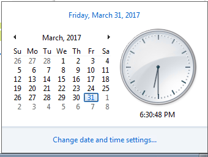

Ravello Environment Pre-Check
=============================

When you RDP in to the Windows box, make sure the time on the windows
client is correct for the current time in the Eastern Time Zone.

If the time needs to be corrected, click on the clock and choose “Change
date and time settings…”

|image3|

.. IMPORTANT:: **If the time is not corrected, please alert an instructor before proceeding**.

