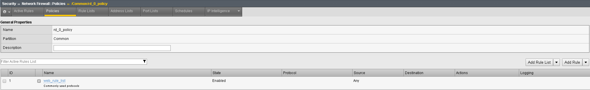

Creating AFM Network Firewall Rules
===================================

Default Actions
---------------

The BIG-IP\ :sup:`®` Network Firewall provides policy-based access
control to and from address and port pairs, inside and outside of your
network. Using a combination of contexts, the network firewall can apply
rules in many ways, including: at a global level, on a per-virtual
server level, and even for the management port or a self IP address.
Firewall rules can be combined in a firewall policy, which can contain
multiple context and address pairs, and is applied directly to a virtual
server.

By default, the Network Firewall is configured in **ADC mode**, a
default allow configuration, in which all traffic is allowed through the
firewall, and any traffic you want to block must be explicitly
specified.

The system is configured in this mode by default so all traffic on your
system continues to pass after you provision the Advanced Firewall
Manager. You should create appropriate firewall rules to allow necessary
traffic to pass before you switch the Advanced Firewall Manager to
Firewall mode. In **Firewall mode**, a default deny configuration, all
traffic is blocked through the firewall, and any traffic you want to
allow through the firewall must be explicitly specified.

The BIG-IP\ :sup:`®` Network Firewall provides policy-based access
control to and from address and port pairs, inside and outside of your
network. By default, the network firewall is configured in ADC mode,
which is a **default allow** configuration, in which all traffic is
allowed to virtual servers and self IPs on the system, and any traffic
you want to block must be explicitly specified. This applies only to the
Virtual Server & Self IP level on the system.

.. IMPORTANT:: Even though the system is in a default allow configuration, if a packet matches no rule in any context on the firewall, a Global Drop rule drops the traffic.

Rule Hierarchy
--------------

With the BIG-IP\ :sup:`®` Network Firewall, you use a context to
configure the level of specificity of a firewall rule or policy. For
example, you might make a global context rule to block ICMP ping
messages, and you might make a virtual server context rule to allow only
a specific network to access an application.

Context is processed in this order:

-  Global

-  Route domain

-  Virtual server / self IP

-  Management port\*

-  Global drop\*

The firewall processes policies and rules in order, progressing from the
global context, to the route domain context, and then to either the
virtual server or self IP context. Management port rules are processed
separately, and are not processed after previous rules. Rules can be
viewed in one list, and viewed and reorganized separately within each
context. You can enforce a firewall policy on any context except the
management port. You can also stage a firewall policy in any context
except management.

.. TIP:: You cannot configure or change the Global Drop context. The Global Drop context is the final context for traffic. Note that even though it is a global context, it is not processed first, like the main global context, but last. If a packet matches no rule in any previous context, the Global Drop rule drops the traffic.

.. image:: http://support.f5.com/kb/global/manual_images/MAN-0439-01/firewall_processing.png

Create and View Log Entries
---------------------------

In this section, you will generate various types of traffic through the
firewall as you did previously, but now you will view the log entries
using the network firewall log. Open your web browser and once again try
to access http://10.30.0.50. Also, try to ping 10.30.0.50.

Open the **Security > Event Logs > Network > Firewall** page on
bigip2.dnstest.lab (192.168.1.150). The log file shows the ping requests
are being accepted and the web traffic is being dropped:

|image6|

Although we will not configure external logging in this lab, you should
be aware that the BIG-IP supports high speed external logging in various
formats including **SevOne**, **Splunk** and **ArcSight**.

Create a Rule List
------------------

Rule lists are a way to group a set of individual rules together and
apply them to the active rule base as a group. A typical use of a rule
list would be for a set of applications that have common requirements
for access protocols and ports. As an example, most web applications
would require TCP port 80 for HTTP and TCP port 443 for SSL/TLS. You
could create a Rule list with these protocols, and apply them to each of
your virtual servers.

Let’s examine some of the default rule lists that are included with AFM.

Go to **Security >Network Firewall > Rule Lists**. They are:

-  \_sys_self_allow_all

-  \_sys_self_allow_defaults

-  \_sys_self_allow_management

|image7|

If you click on **\_sys_self_allow_management** you’ll see that it is
made up of two different rules that will allow management traffic (port
22/SSH and port 443 HTTPS). Instead of applying multiple rules over and
over across multiple servers, you can put them in a rule list and then
apply the rule list as an ACL.

|image8|

On bigip2.dnstest.lab (192.168.1.150) create a rule list to allow Web
traffic. A logical container must be created before the individual rules
can be added. You will create a list with two rules, to allow port 80
(HTTP) and reject traffic from a specific IP subnet. First you need to
create a container for the rules by going to:

**Security > Network Firewall > Rule Lists** and select **Create.**

For the **Name** enter **web_rule_list**, provide an optional
description and then click **Finished.**

|image9|

Edit the **web_rule_list** by selecting it in the Rule Lists table, then
click the **Add** button in the Rules section. Here you will add two
rules into the list; the first is a rule to allow HTTP.

|image10|

+-------------------------+------------------------------------------------+
| **Name**                | allow_http                                     |
+=========================+================================================+
| **Protocol**            | TCP                                            |
+-------------------------+------------------------------------------------+
| **Source**              | Leave at Default of **Any**                    |
+-------------------------+------------------------------------------------+
| **Destination Address** | **Specify...**\ 10.30.0.50, then click **Add** |
+-------------------------+------------------------------------------------+
| **Destination Port**    | **Specify…** Port **80**, then click **Add**   |
+-------------------------+------------------------------------------------+
| **Action**              | **Accept-Decisively**                          |
+-------------------------+------------------------------------------------+
| **Logging**             | Enabled                                        |
+-------------------------+------------------------------------------------+

|image11|

Select **Repeat** when done.

Create another rule to reject all access from the 10.20.0.0/24 network.

+-------------------------+-------------------------------------+
| **Name**                | reject_10_20_0_0                    |
+=========================+=====================================+
| **Protocol**            | Any                                 |
+-------------------------+-------------------------------------+
| **Source**              | **Specify…**\ Address 10.20.0.0/24, |
|                         | then click **Add**                  |
+-------------------------+-------------------------------------+
| **Destination Address** | Any                                 |
+-------------------------+-------------------------------------+
| **Destination Port**    | Any                                 |
+-------------------------+-------------------------------------+
| **Action**              | Reject                              |
+-------------------------+-------------------------------------+
| **Logging**             | Enabled                             |
+-------------------------+-------------------------------------+

Select **Finished** when completed. When you exit, you’ll notice the
reject rule is after the **allow_http** rule. This means that HTTP
traffic from 10.20.0.0/24 will be accepted, while all other traffic from
this subnet will be rejected based on the ordering of the rules as seen
below:

|image12|

Create a Policy with a Rule List
--------------------------------

Policies are a way to group a set of individual rules together and apply
them to the active policy base as a group. A typical use of a policy
list would be for a set of rule lists that have common requirements for
access protocols and ports.

Create a policy list to allow the traffic you created in the rule list
in the previous section. A logical container must be created before the
individual rules can be added. First you need to create a container for
the policy by going to:

**Security > Network Firewall > Policies** and select **Create.**

You’ll notice that before Milton detached from Initech, he created a
global policy named **‘Global’** to allow basic connectivity to make
troubleshooting easier.

For the **Name** enter **rd_0_policy**, provide an optional description
and then click **Finished.
(Note: We commonly use “RD” in our rules to help reference the “Route
Domain”, default is 0)**

|image13|

Edit the **rd_0_policy** by selecting it in the Policy Lists table, then
click the **Add Rule List** button. Here you will add the rule list you
created in the previous section. For the **Name,** start typing
**web_rule_list**, you will notice the name will auto complete, select
the rule list **/Common/web_rule_list**, provide an optional description
and then click **Done Editing.**

|image14|

When finished your policy should look like the screen shot below.

|image15|

You will notice the changes are unsaved and need to be committed to the
system. This is a nice feature to have enabled to verify you want to
commit the changes you’ve just made without a change automatically being
implemented.

To commit the change, simply click **“Commit** Changes **to System”**
located at the top of the screen.

|image16|

Once committed you’ll notice the rule now becomes active and the
previous commit warning is removed.

|image17|

Add the Rule List to a Route Domain
-----------------------------------

In this section, you are going to attach the rule to a route domain
using the **Security** selection in the top bar within the **Route
Domain** GUI interface.

Go to **Network**, then click on **Route Domains**, then select the
hyperlink for route domain **0**.

Now click on the **Security** top bar selection, which is a new option
that was added in version 11.3.

In the Network Firewall section, set the Enforcement: to **“Enabled…”.**

Select the Policy you just created, “\ **rd_0_policy**\ ” and click
Update.

|image18|

Review the rules that are now applied to this route domain by navigating
to:

**Security > Network Firewall > Active Rules.**

From the **Context Filter** select **Route Domain 0**. You can expand
the web_rule_list by clicking the plus sign, your screen should look
similar to the below screen shot.

|image19|

Test the New Firewall Rules
---------------------------

Once again you will generate traffic through the BIG-IP AFM and then
view the AFM (firewall) logs.

-  Ping 10.30.0.50

-  Open a new Web browser and access http://10.30.0.50

-  Open a new Web browser and access http://10.30.0.50:8081

-  SSH to 10.30.0.50 using Web Server shortcut (PUTTY) on desktop.

In the Configuration Utility, open the **Security > Event Logs > Network
> Firewall** page.

Access for port 80 was granted to a host using the web_rule_list:
**allow_http** rule.

|image20|

Requests for port 8081, and 22 were all rejected due to the
reject_10_20_0_0 rule.

|image21|

You may verify this, by going to **Security > Network Firewall > Active
Rules**, then selecting the context for route domain 0. Note the
**Count** field next to each rule as seen below. Also note how each rule
will also provide a **Latest Matched** field so you will know the last
time each rule was matched:

|image22|

Congratulations! Day one and you’ve already saved the day. Hang on,
something isn’t right, the images Mr. Lumbergh talked about are not
populating, they look like broken links.

|image23|

Let’s refresh the web page once more and see what the logs show….

|image24|

If we follow the flow we can see the traffic to 10.30.0.50 is permitted
on port 80 however; there appears to be a second connection attempting
to open to another server, 10.40.0.50, also on port 80 (glad we put in
that reject rule and are logging all the traffic flows). Let’s look at
how this web page is written. To view the page source details, simply
**right** click anywhere on the **10.30.0.50** web page and select “view
page source”

|image25|

Very interesting, it appears there are two images and they are links to
another server which appear to be a server on the application network,
which is also a link off of the firewall. You can verify this by looking
at the network settings on the BIG-IP found under: **Network > VLANs
and/or Network > Self IPs.** To resolve, let’s create another rule list
for this network as well to keep the rule lists separated for security
reasons.

Creating an Additional Rule List for Additional Services
--------------------------------------------------------

Rules and Rule Lists can also be created and attached to a context from
the Active Rules section of the GUI. Go to the

**Security > Network Firewall > Rule Lists**

Create a **Rule List** called **application_rule_list** then click
**Finished**.

Enter the rule list by clicking on its hyperlink, then in the **Rules**
section click **Add**, and add the following information, then click
**Finished**.

+-------------------------+-----------------------------------------------+
| **Name**                | allow_http                                    |
+=========================+===============================================+
| **Protocol**            | TCP                                           |
+-------------------------+-----------------------------------------------+
| **Source**              | Leave at Default of **Any**                   |
+-------------------------+-----------------------------------------------+
| **Destination Address** | **Specify…**\ 10.40.0.50, then click **Add**  |
+-------------------------+-----------------------------------------------+
| **Destination Port**    | **Specify…**\ Port **80**, then click **Add** |
+-------------------------+-----------------------------------------------+
| **Action**              | **Accept-Decisively**                         |
+-------------------------+-----------------------------------------------+
| **Logging**             | Enabled                                       |
+-------------------------+-----------------------------------------------+

|image26|

Add Another Rule List to the Policy
-----------------------------------

Use the **Policies** page to add the new firewall rule list to the
**rd_0_policy**.

Open the **Security > Network Firewall > Policies** page.

Click on the policy name to modify the policy.

The only current active rule list is for the **web_policy**. Click on
the arrow next to **Add Rule List, then select, Add the rule list AT
END)** to add the new rule list you just created. For **Name** begin
typing ‘application_rule_list’, select /Common/application_rule_list,
then click **Done Editing**.

Remember to Commit the changes to system before proceeding.

Once completed, you should see a policy similar to the one below:

|image27|

Test Access to the Server
-------------------------

-  Open a new Web browser and access http://10.30.0.50

Good to, wait, **not go**. What happened? I added a rule, why didn’t this
work? 

Let’s look at the logs again (**Security > Event Logs > Network >
Firewall).** They basically look the same as before, lets look at the
ordering of the rule we just created (**Security > Network Firewall >
Active Rules change contex to route domain 0).** Take note the newly
created rule has a counter value of 0, if we look at the order we can
see the reject rule, which we added in the web_rule_list has incremented
and appears to be matching the traffic before it reaches our new rule.
**(Be sure to expand the Rule List to see the counts)** Let’s modify the
rule order slightly to accomplish what we’re looking for. From within
the Active Rules section simply drag the application_rule_list **ABOVE**
the web_rule_list. Don’t forget to commit the changes.

The new ordering should look something like the screen shot below:

|image28|

.. _test-access-to-the-server-1:

Test Access to the Server
-------------------------

-  Open a new Web browser and access http://10.30.0.50

**Success!!**

Before we continue let’s clean up the rules just a little for best
practices. The clean-up/catch-all/drop/etc rule is typically applied to
the end of your policy, not necessarily within the rule-list. While its
perfectly acceptable to have drop statements within individual rules to
prevent certain traffic, the broader drop statement should be applied at
the end of the policy (remember how AFM processes contexts from the
beginning of this lab – see pages 6+7).

Use the **Rule Lists** page to modify the firewall rule
**‘web_rule_list’**. Open the **Security > Network Firewall > Rule
Lists** page. Click on the rule list **‘web_rule_list’** to modify the
rule list. Check the box next to the reject_10_20_0_0 rule and click
‘\ **Remove’.** The updated rule should look something like the below
screen shot:

|image29|

Next, you’ll want to add the reject rule to the policy. In the
Configuration Utility, open the **Security > Network Firewall >
Policies** page. Click on the **rd_0_policy**. Select ‘Add Rule’ drop
down and select at the end. You’ll notice all the same options are
available within a policy as they are within a rule-list. Create an
entry with the following information then click Done Editing and commit
the change.

+-------------------------+------------------------------------------+
| **Name**                | reject_10_20_0_0                         |
+=========================+==========================================+
| **Protocol**            | Any                                      |
+-------------------------+------------------------------------------+
| **Source**              | Address 10.20.0.0/24, then click **Add** |
+-------------------------+------------------------------------------+
| **Destination Address** | Any                                      |
+-------------------------+------------------------------------------+
| **Destination Port**    | Any                                      |
+-------------------------+------------------------------------------+
| **Action**              | Reject                                   |
+-------------------------+------------------------------------------+
| **Logging**             | Enabled                                  |
+-------------------------+------------------------------------------+

The new Policy should look something like the screen shot below:

|image30|

Test the New Firewall Rules
---------------------------

Once again you will generate traffic through the BIG-IP AFM and then
view the AFM (firewall) logs.

-  Ping 10.30.0.50

-  Open a new Web browser and access http://10.30.0.50

-  Open a new Web browser and access http://10.30.0.50:8081

-  SSH to 10.30.0.50 using Web Server shortcut on desktop

In the Configuration Utility, open the **Security > Event Logs > Network
> Firewall** page.

Access for port 80 on 10.30.0.50 was granted using the web_rule_list:
**allow_http** rule.

|image31|

Access for port 80 on 10.40.0.50 was granted using the
application_rule_list: **allow_http** rule.\ |image32|

Ping to 10.30.0.50 was granted using the global rule.

|image33|

All other traffic was rejected by the rd_0_policy reject_10_20_0_0
reject rule

|image34|

View Firewall Reports
---------------------

View several of the built-in network firewall reports and graphs on the
BIG-IP system. Open the **Security >Reporting > Network > Enforced
Rules** page. The default report shows all the rule contexts that were
matched in the past hour.

|image35|

The default view gives reports per Context, in the drop-down menu select
**Rules (Enforced)**.

|image36|

From the **View By** list, select **Destination Ports (Enforced)**.

|image37|

This redraws the graph to report more detail for all the destination
ports that matched an ACL.

|image38|

From the **View By** list, select **Source IP Addresses (Enforced)**.
This shows how source IP addresses matched an ACL clause:

|image39|

.. |image6| image:: ../media/image7.png
   :width: 6.49097in
   :height: 1in

.. |image9| image:: ../media/image10.png
   :width: 3.25in
   :height: 1.46554in
.. |image10| image:: ../media/image11.png
   :width: 6.2954in
   :height: 1.66667in

.. |image12| image:: ../media/image13.png
   :width: 6.49097in
   :height: 0.25903in
.. |image13| image:: ../media/image14.png
   :width: 4.92847in
   :height: 1.35694in

.. |image15| image:: ../media/image16.png
   :width: 6.5in
   :height: 1.29653in
.. |image16| image:: ../media/image17.png
   :width: 6.49097in
   :height: 0.47222in

.. |image19| image:: ../media/image20.png
   :width: 6.49514in
   :height: 1.37014in

.. |image21| image:: ../media/image22.png
   :width: 6.48125in
   :height: 0.60208in
.. |image22| image:: ../media/image23.png
   :width: 6.49097in
   :height: 1.76875in
.. |image23| image:: ../media/image24.png
   :width: 2.67327in
   :height: 2.26704in

.. |image25| image:: ../media/image26.png
   :width: 6.5in
   :height: 1.22222in

.. |image28| image:: ../media/image29.png
   :width: 6.5in
   :height: 1.02778in
.. |image29| image:: ../media/image30.png
   :width: 6.49097in
   :height: 1.01875in
.. |image30| image:: ../media/image31.png
   :width: 6.5in
   :height: 1.14792in
.. |image31| image:: ../media/image32.png
   :width: 6.5in
   :height: 0.5in
.. |image32| image:: ../media/image32.png
   :width: 6.5in
   :height: 0.5in

.. |image35| image:: ../media/image35.png
   :width: 6.49097in
   :height: 2.49097in
.. |image36| image:: ../media/image36.png
   :width: 6.5in
   :height: 2.5in
.. |image37| image:: ../media/image37.png
   :width: 2.64727in
   :height: 1.53731in
.. |image38| image:: ../media/image38.png
   :width: 6.5in
   :height: 2.66667in
.. |image39| image:: ../media/image39.png
   :width: 6.5in
   :height: 2.08333in
