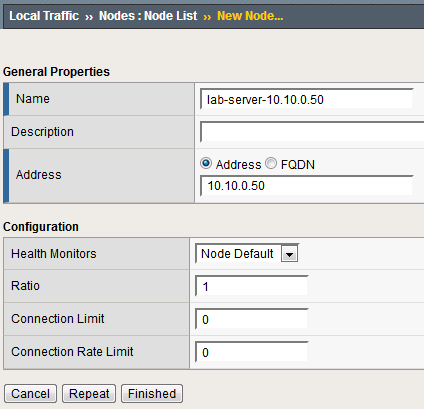
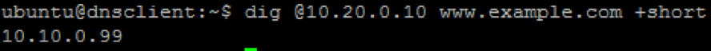
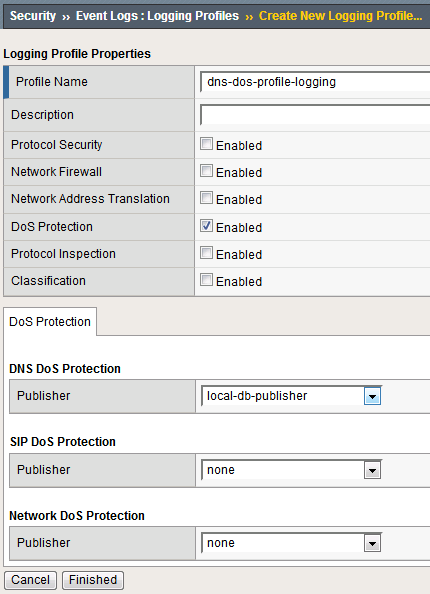
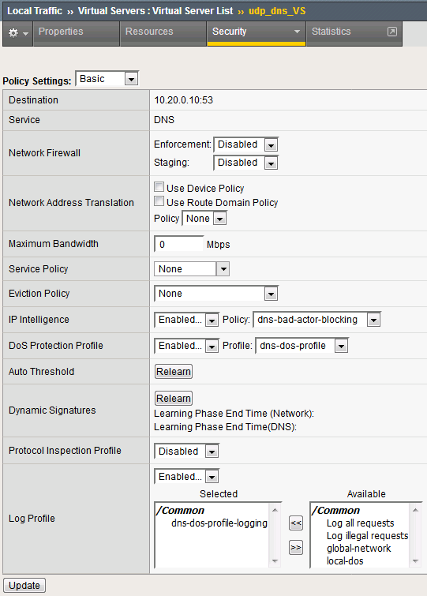
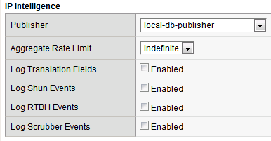

Lab 1 – Advanced Firewall Manager (AFM) DNS DoS
===============================================

It is day two of your career at Initech, and you are under attack!! You
walk into the office on day two only to learn your DNS servers are being
attacked by Joanna who took out her flair frustrations on your DNS
servers. Before you can protect the servers however, you must first tune
and configure them appropriately. (The most challenging part of DoS
based protection is tuning correctly).

1.  Launch the Chrome shortcut titled “BIG-IP UI” on the desktop of your
    lab jump server. For this lab you will be working on
    bigip1.dnstest.lab (http://192.168.1.100). The credentials for the
    BIG-IP are conveniently displayed in the login banner. Just in case:
    **admin / 401elliottW!**

2.  Navigate to **Local Traffic** > **Nodes** and create a new node with
    the following settings, leaving unspecified fields at their default
    value:

    #. Name: lab-server-10.10.0.50
    #. | Address: 10.10.0.50
       | |image51|

3.  Click **Finished** to add the new node.

4.  Navigate to **Local Traffic** > **Pools** and create a new pool with
    the following settings, leaving unspecified attributes at their
    default value:

    c. Name: lab-server-pool

    d. Health Monitors: gateway_icmp

    e. New Members: Node List

       i.   Address: lab-server-10.10.0.50

       ii.  Service Port: \* (All Services)

       iii. | Click **Add** to add the new member to the member list.
            | |image52|

5.  Click **Finished** to create the new pool.

6.  Because the attack server will be sending a huge amount of traffic,
    we’ll need a large SNAT pool. Navigate to **Local Traffic** >
    **Address Translation** > **SNAT Pool List** and create a new SNAT
    pool with the following attributes:

    f. Name: inside_snat_pool

    g. | Member List (click Add after each IP):
       | 10.10.0.125, 10.10.0.126, 10.10.0.127, 10.10.0.128,
         10.10.0.129, 10.10.0.130

    h. | Click Finished
       | |image53|

7.  Navigate to **Local Traffic** > **Virtual Servers** and create a new
    virtual server with the following settings, leaving unspecified
    fields at their default value:

    i. Name: udp_dns_VS
    j. Destination Address/Mask: 10.20.0.10
    k. Service Port: 53 (other)
    l. Protocol: UDP
    m. Source Address Translation: SNAT
    n. SNAT Pool: inside_snat_pool
    o. Default Pool: lab-server-pool

8.  | Click Finished
    | |image54|
9.  We’ll now test the new DNS virtual server. SSH into the attack host
    by clicking the “Attack Host (Ubuntu)” icon on the jump host
    desktop.
10. | Issue the ``dig @10.20.0.10 www.example.com +short`` command on the BASH CLI of the attack host.  You should see output similar to:
    | |image55|
    | This verifies that DNS traffic is passing through the BIG-IP.

11. Return to the BIG-IP and navigate to **Local Traffic** > **Virtual Servers** and create a new virtual server with the following settings, leaving unspecified fields at their default value:

    p. Name: other_protocols_VS

    q. Destination Address/Mask: 10.20.0.10

    r. Service Port: \* (All Ports)

    s. Protocol: \* All Protocols

    t. Any IP Profile: ipother

    u. Source Address Translation: SNAT

    v. SNAT Pool: inside_snat_pool

    w. Default Pool: lab-server-pool

12. | Click Finished
    | |image56|

13. Return to the Attack Host SSH session and attempt to SSH to the
    server using SSH 10.20.0.10. Simply verify that you are prompted for
    credentials and press CTRL+C to cancel the session. This verifies
    that non-DNS traffic is now flowing through the BIG-IP.

Detecting and Preventing DNS DoS Attacks on a Virtual Server
------------------------------------------------------------

Establishing a DNS server baseline
^^^^^^^^^^^^^^^^^^^^^^^^^^^^^^^^^^

Before we can prevent Joanna from attacking our DNS server, again, we
should establish a baseline for how many QPS our DNS server can handle.
For this lab, let’s find the magic number of QPS that causes 50% CPU
utilization on the BIND process.

1. Connect to the Victim Server SSH session by double-clicking the
   **Victim Server (Ubuntu)** shortcut on the jump host desktop.

2. From the BASH prompt, enter **top** and press **Enter** to start the
   top utility.

3. You will see a list of running processes sorted by CPU utilization,
   like the output below:

   |image57|

4. Connect to the Attack Host SSH session by double-clicking the
   **Attack Host (Ubuntu)** shortcut on the jump host desktop.

5. | Start by sending 500 DNS QPS for 30 seconds to the host using the
     following syntax:
   | dnsperf -s 10.20.0.10 -d queryfile-example-current -c 20 -T 20 -l
     30 -q 10000 -Q 500

6. Observe CPU utilization over the 30 second window for the **named**
   process. If the CPU utilization is below 45%, increase the QPS by
   increasing the -Q value. If the CPU utilization is above 55%,
   decrease the QPS. This

7. Record the QPS required to achieve a sustained CPU utilization of
   approximately 50%. Consider this the QPS that the server can safely
   sustain for demonstration purposes.

8. | Now, attack the DNS server with 10,000 QPS using the following
     syntax:
   | dnsperf -s 10.20.0.10 -d queryfile-example-current -c 20 -T 20 -l
     30 -q 10000 -Q 10000

9. You’ll notice that the CPU utilization on the victim server
   skyrockets, as well as DNS query timeout errors appearing on the
   attack server’s SSH session. This shows your DNS server is
   overwhelmed.

Configuring a DoS Logging Profile
^^^^^^^^^^^^^^^^^^^^^^^^^^^^^^^^^

We’ll create a DoS logging profile so that we can see event logs in the
BIG-IP UI during attack mitigation.

1. On the BIG-IP web UI, navigate to **Security** > **Event Logs** >
   **Logging Profiles** and create a new profile with the following
   values, leaving unspecified attributes at their default value:

   a. Profile Name: dns-dos-profile-logging

   b. DoS Protection: Enabled

   c. | DNS DoS Protection Publisher: local-db-publisher and click
        finish
      | |image58|

Configuring a DoS Profile
^^^^^^^^^^^^^^^^^^^^^^^^^

We will now create a DoS profile with manually configured thresholds to
limit the attack’s effect on our server.

1. Navigate to **Security** > **DoS Protection** > **DoS Profiles**

2. Create a new DoS profile with the name **dns-dos-profile**.

3. | Click **Finished**.
   | |image59|

4. The UI will return to the DoS Profiles list. Click the
   **dns-dos-profile** name.

5. Click the **Protocol Security** tab and select **DNS Security** from
   the drop-down.

6. Click the **DNS A Query** vector from the Attack Type list.

7. Modify the **DNS A Query** vector configuration to match the
   following values, leaving unspecified attributes with their default
   value:

   a. State: Mitigate

   b. Threshold Mode: Fully Manual

   c. Detection Threshold EPS: (Set this at 80% of your safe QPS value)

   d. | Mitigation Threshold EPS: (Set this to your safe QPS value)
      | |image60|

8. Make sure that you click **Update** to save your changes.

Attaching a DoS Profile
^^^^^^^^^^^^^^^^^^^^^^^

We will attach the DoS profile to the virtual server that we configured
to manage DNS traffic.

1. Navigate to **Local Traffic** > **Virtual Servers** > **Virtual
   Server List**.

2. Click on the **udp_dns_VS** name.

3. Click on the **Security** tab and select **Policies**.

4. In the **DoS Protection Profile** field, select **Enabled** and
   choose the **dns-dos-profile**.

5. In the **Log Profile**, select **Enabled** and move the
   **dns-dos-profile-logging** profile from **Available** to
   **Selected**.

6. Click **Update**.

Simulate a DNS DDoS Attack
^^^^^^^^^^^^^^^^^^^^^^^^^^

1. Open the SSH session to the victim server and ensure the top utility
   is running.

2. | Once again, attack your DNS server from the attack host using the
     following syntax:
   | dnsperf -s 10.20.0.10 -d queryfile-example-current -c 20 -T 20 -l
     30 -q 10000 -Q 10000

3. On the server SSH session running the top utility, notice the CPU
   utilization on your server remains in a range that ensures the DNS
   server is not overwhelmed.

4. After the attack, navigate to **Security** > **Event Logs** > **DoS**
   > **DNS Protocol**. Observe the logs to see the mitigation actions
   taken by the BIG-IP. Be sure to scroll right…

   |image61|

DNS DDoS Mitigations for Continued Service
^^^^^^^^^^^^^^^^^^^^^^^^^^^^^^^^^^^^^^^^^^

At this point, you have successfully configured the BIG-IP to limit the
amount of resource utilization on the BIG-IP, thus further frustrating
Joanna on her flair rage. Unfortunately, even valid DNS requests can be
caught in the mitigation we’ve configured. There are further steps that
can be taken to mitigate Joanna’s attack that will allow non-malicious
DNS queries.

Bad Actor Detection
^^^^^^^^^^^^^^^^^^^

Bad actor detection and blacklisting allows us to completely block
communications from malicious hosts at the BIG-IP, completely preventing
those hosts from reaching the back-end servers. To demonstrate:

1.  Navigate to **Security** > **DoS Protection** > **DoS Profiles**.

2.  Click on the **dns-dos-profile** profile name.

3.  Click on the **Protocol Security** tab then select **DNS Security**.

4.  Click on the **DNS A Query** attack type name.

5.  Modify the vector as follows:

    a. Bad Actor Detection: Checked

    b. Per Source IP Detection Threshold EPS: 80

    c. Per Source IP Mitigation Threshold EPS: 100

    d. Add Source Address to Category: Checked

    e. Category Name: denial_of_service

    f. Sustained Attack Detection Time: 15 seconds

    g. | Category Duration Time: 60 seconds
       | |image62|

6.  Make sure you click **Update** to save your changes.

7.  Navigate to **Security** > **Network Firewall** > **IP
    Intelligence** > **Policies** and create a new IP Intelligence
    policy with the following values, leaving unspecified attributes at
    their default values:

    h. Name: dns-bad-actor-blocking

    i. Default Log Actions section:

       i. Log Blacklist Category Matches: Yes

    j. Blacklist Matching Policy

       ii. Create a new blacklist matching policy:

           1. Blacklist Category: denial_of_service

           2. |image63|\ Click **Add** to add the policy then click
              finished

8.  Navigate to **Local Traffic** > **Virtual Servers** > **Virtual
    Server List**.

9.  Click on the **udp_dns_VS** virtual server name.

10. Click on the **Security** tab and select **Policies**.

11. | Enable **IP Intelligence** and choose the
      **dns-bad-actor-blocking** policy.
    | |image64|

12. Make sure you click **Update** to save your changes.

13. Navigate to **Security** > **Event Logs** > **Logging Profiles**.

14. Click the **global-network** logging profile name.

15. | Under the **Network Firewall** tab (next to Protocol Security),
      set the IP Intelligence Publisher to **local-db-publisher** and
      check **Log Shun Events**.
    | |image65|

16. Click **Update** to save your changes.

17. Click the **dns-dos-profile-logging** logging profile name.

18. | Check **Enabled** next to **Network Firewall**.
    | |image66|

19. | Under the **Network Firewall** tab, change the **IP Intelligence
      Publisher** to **local-db-publisher** and click **Update**.
    | |image67|

20. Bring into view the Victim Server SSH session running the top
    utility to monitor CPU utilization.

21. | On the Attack Server host, launch the DNS attack once again using
      the following syntax:
    | dnsperf -s 10.20.0.10 -d queryfile-example-current -c 20 -T 20 -l
      30 -q 10000 -Q 10000

22. | You’ll notice CPU utilization on the BIG-IP begin to climb, but
      slowly drop. The attack host will show that queries are timing out
      as shown below. This is due to the BIG-IP blacklisting the bad
      actor.
    | |image68|

23. Navigate to **Security** > **Event Logs** > **Network** > **IP
    Intelligence**. Observe the bad actor blocking mitigation logs.

24. | Navigate to **Security** > **Event Logs** > **Network** >
      **Shun**. This screen shows the bad actor being added to (and
      later deleted from) the shun category.
    | |image69|

25. While the attack is running, navigate to **Security** > **DoS
    Protection**> **DoS Overview (you may need to refresh or set the
    auto refresh to 10 seconds).** You will notice from here you can see
    all the details of the active attacks. You can also modify an attack
    vector right from this screen by clicking on the attack vector and
    modifying the fly out.

|image70|

26. | Navigate to **Security** > **Reporting** > **Protocol** > **DNS**.
      Change the **View By** drop-down to view various statistics around
      the DNS traffic and attacks.
    | |image71|

27. Navigate to **Security** > **Reporting** > **Network** > **IP
    Intelligence**. The default view may be blank. Change the **View
    By** drop-down to view various statistics around the IP Intelligence
    handling of the attack traffic.

28. | Navigate to **Security** > **Reporting** > **DoS** > **Dashboard**
      to view an overview of the DoS attacks and timeline. You can
      select filters in the filter pane to highlight specific attacks.
    | |image72|

29. Finally, navigate to **Security** > **Reporting** > **DoS** >
    **Analysis**. View detailed statistics around each attack.

|image73|

Remote Triggered Black Holing
^^^^^^^^^^^^^^^^^^^^^^^^^^^^^

The BIG-IP supports the advertisement of bad actor(s) to upstream
devices via BGP to block malicious traffic closer to the source. This is
accomplished by publishing a blacklist to an external resource. This is
not demonstrated in this lab.

Silverline Mitigation
^^^^^^^^^^^^^^^^^^^^^
	
F5’s Silverline service offers “always on” and “on demand” DDoS
scrubbing that could assist in this scenario as well. This is not
demonstrated in this lab.

Filtering specific DNS operations
---------------------------------

The BIG-IP offers the ability to filter DNS query types and header
opcodes to act as a DNS firewall. To demonstrate, we will block MX
queries from our DNS server.

1.  Open the SSH session to the Attack Host.

2.  | Perform an MX record lookup by issuing the following command:
    | dig @10.20.0.10 MX example.com

3.  The server doesn’t have a record for this domain. This server
    doesn’t have MX records, so those requests should be filtered

4.  Navigate to **Security** > **Protocol Security** > **Security
    Profiles** > **DNS** and create a new DNS security profile with the
    following values, leaving unspecified attributes at their default
    value:

    a. Name: dns-block-mx-query

    b. | Query Type Filter: move mx from Available to Active and click
         finished
       | |image74|

5.  Navigate to **Local Traffic** > **Profiles** > **Services** >
    **DNS**. **NOTE:** if you are mousing over the services, DNS may not
    show up on the list. Select **Services** and then use the pulldown
    menu on services to select **DNS**.

6.  Create a new DNS services profile with the following values, leaving
    unspecified values at their default values:

    c. Name: dns-block-mx

    d. DNS Traffic

       i.  DNS Security: Enabled

       ii. | DNS Security Profile Name: dns-block-mx-query. Click
             finished
           | |image75|

7.  Navigate to **Local Traffic** > **Virtual Servers** > **Virtual
    Server List**.

8.  Click on the **udp_dns_VS** virtual server name.

9.  In the **Configuration** section, change the view to **Advanced**.

10. | Set the **DNS Profile** to **dns-block-mx**.
    | |image76|

11. Click **Update** to save your settings.

12. Navigate to **Security** > **Event Logs** > **Logging Profiles**.

13. Click on the **dns-dos-profile-logging** logging profile name.

14. Check **Enabled** next to **Protocol Security**.

15. | In the **Protocol Security** tab, set the **DNS Security
      Publisher** to **local-db-publisher** and check all five of the
      request log types.
    | |image77|

16. Make sure that you click **Update** to save your settings.

17. | Return to the Attack Server SSH session and re-issue the MX query
      command:
    | dig @10.20.0.10 MX example.com

18. The query hangs as the BIG-IP is blocking the MX lookup.

19. | Navigate to **Security** > **Event Logs** > **Protocol** >
      **DNS**. Observe the MX query drops.
    | |image78|

This concludes the DNS portion of the lab. On the Victim Server, stop
the top utility by pressing **CTRL + C**. No mail for you Joanna!!

Advanced Firewall Manager (AFM) Detecting and Preventing System DoS and DDoS Attacks
====================================================================================

Configure Logging
~~~~~~~~~~~~~~~~~

Configuring a logging destination will allow you to verify the BIG-IPs
detection and mitigation of attacks, in addition to the built-in
reporting.

1. In the BIG-IP web UI, navigate to **Security** > **DoS Protection** >
   **Device Configuration** > **Properties**.

2. Under **Log Pubisher**, select **local-db-publisher**.

3. | Click the **Commit Changes to System** button.
   | |image79|

.. _section-5:

Simulating a Christmas Tree Packet Attack
~~~~~~~~~~~~~~~~~~~~~~~~~~~~~~~~~~~~~~~~~

Joanna was feeling festive this morning. In this example, we’ll set the
BIG-IP to detect and mitigate Joanna’s attack where all flags on a TCP
packet are set. This is commonly referred to as a Christmas Tree Packet
and is intended to increase processing on in-path network devices and
end hosts to the target.

We’ll use the hping utility to send 25,000 packets to our server, with
random source IPs to simulate a DDoS attack where multiple hosts are
attacking our server. We’ll set the SYN, ACK, FIN, RST, URG, PUSH, Xmas
and Ymas TCP flags.

1.  In the BIG-IP web UI, navigate to **Security** > **DoS Protection**
    > **Device Configuration** > **Network Security**.

2.  Expand the **Bad-Header-TCP** category in the vectors list.

3.  Click on the **Bad TCP Flags (All Flags Set)** vector name.

4.  Configure the vector with the following parameters:

    a. State: Mitigate

    b. Threshold Mode: Fully Manual

    c. Detection Threshold EPS: Specify 50

    d. Detection Threshold Percent: Specify 200

    e. | Mitigation Threshold EPS: Specify 100
       | |image80|

5.  Click **Update** to save your changes.

6.  Open the BIG-IP SSH session and scroll the ltm log in real time with
    the following command: tail -f /var/log/ltm

7.  | On the attack host, launch the attack by issuing the following
      command on the BASH prompt:
    | sudo hping3 10.20.0.10 --flood --rand-source --destport 80 -c
      25000 --syn --ack --fin --rst --push --urg --xmas --ymas

8.  | You’ll see the BIG-IP ltm log show that the attack has been
      detected:
    | |image81|

9.  | After approximately 60 seconds, press **CTRL+C** to stop the
      attack.
    | |image82|

10. Navigate to **Security** > **DoS Protection**> **DoS Overview (you
    may need to refresh or set the auto refresh to 10 seconds).** You’ll
    notice from here you can see all the details of the active attacks.
    You can also modify an attack vector right from this screen by
    clicking on the attack vector and modifying the details in the fly
    out panel.

    |image83|

11. | Return to the BIG-IP web UI. Navigate to **Security** > **Event
      Logs** > **DoS** > **Network** > **Events**. Observe the log
      entries showing the details surrounding the attack detection and
      mitigation.
    | |image84|

12. Navigate to **Security** > **Reporting** > **DoS** > **Analysis**.
    Single-click on the attack ID in the filter list to the right of the
    charts and observe the various statistics around the attack.

Simulating a TCP SYN DDoS Attack
~~~~~~~~~~~~~~~~~~~~~~~~~~~~~~~~

In the last example, Joanna crafted a packet that is easily identified
as malicious, as its invalid. We’ll now simulate an attack with traffic
that could be normal, acceptable traffic. The TCP SYN flood attack will
attempt to DDoS a host by sending valid TCP traffic to a host from
multiple source hosts.

1.  In the BIG-IP web UI, go to **Security** > **DoS Protection** >
    **Device** **Configuration** > **Network Security**.

2.  Expand the **Flood** category in the vectors list.

3.  Click on **TCP Syn Flood** vector name.

4.  Configure the vector with the following parameters:

    a. State: Mitigate

    b. Threshold Mode: Fully Manual

    c. Detection Threshold EPS: 200

    d. Detection Threshold Percent: 500

    e. | Mitigation Threshold EPS: 400
       | |image85|

5.  Click **Update** to save your changes.

6.  Open the BIG-IP SSH session and scroll the ltm log in real time with
    the following command: tail -f /var/log/ltm

7.  | On the attack host, launch the attack by issuing the following
      command on the BASH prompt:
    | sudo hping3 10.20.0.10 --flood --rand-source --destport 80 --syn
      -d 120 -w 64

8.  After about 60 seconds, stop the flood attack by pressing **CTRL +
    C**.

9.  Return to the BIG-IP web UI and navigate to **Security** > **Event
    Logs** > **DoS** > **Network** > **Events**. Observe the log entries
    showing the details surrounding the attack detection and mitigation.

10. Navigate to **Security** > **Reporting** > **DoS** > **Dashboard**
    to view an overview of the DoS attacks and timeline. You can select
    filters in the filter pane to highlight the specific attack.

11. Finally, navigate to **Security** > **Reporting** > **DoS** >
    **Analysis**. View detailed statistics around the attack.

Preventing Global DoS Sweep and Flood Attacks
---------------------------------------------

In the last section, the focus was on attacks originating from various
hosts. In this section, we will focus on mitigating flood and sweep
attacks from a single host.

Single Endpoint Sweep
^^^^^^^^^^^^^^^^^^^^^

The single endpoint sweep is an attempt for an attacker to send traffic
across a range of ports on the target server, typically to scan for open
ports.

1.  In the BIG-IP web UI, navigate to **Security** > **DoS Protection**
    > **Device Configuration** > **Network Security**.

2.  Expand the **Single-Endpoint** category in the vectors list.

3.  Click on **Single Endpoint Sweep** vector name.

4.  Configure the vector with the following parameters:

    a. State: Mitigate

    b. Threshold Mode: Fully Manual

    c. Detection Threshold EPS: 150

    d. Mitigation Threshold EPS: 200

    e. Add Source Address to Category: Checked

    f. Category Name: denial_of_service

    g. Sustained Attack Detection Time: 10 seconds

    h. Category Duration Time: 60 seconds

    i. | Packet Type: Move All IPv4 to Selected
       | |image86|

5.  Click **Update** to save your changes.

6.  Navigate to **Security** > **Network Firewall** > **IP
    Intelligence** > **Policies**.

7.  | In the **Global Policy** section, change the **IP Intelligence
      Policy** to **ip-intelligence**.
    | |image87|

8.  Click **Update**.

9.  Click on the **ip-intelligence** policy in the policy list below.

10. Create a new Blacklist Matching Policy in the IP Intelligence Policy
    Properties section with the following attributes, leaving
    unspecified attributes with their default values:

    j. Blacklist Category: denial-of-service

    k. Action: drop

    l. Log Blacklist Category Matches: Yes

11. | Click **Add** to add the new Blacklist Matching Policy.
    | |image88|

12. Click **Update** to save changes to the ip-intelligence policy.

13. Open the BIG-IP SSH session and scroll the ltm log in real time with
    the following command: tail -f /var/log/ltm

14. On the victim server, start a packet capture with an SSH filter by
    issuing sudo tcpdump -nn not port 22

15. | On the attack host, launch the attack by issuing the following
      command on the BASH prompt:
    | sudo hping3 10.20.0.10 --flood --scan 1-65535 -d 128 -w 64 --syn

16. You will see the scan find a few open ports on the server, and the
    server will show the inbound sweep traffic. However, you will notice
    that the traffic to the server stops after a short time (10 seconds,
    the configured sustained attack detection time.) Leave the test
    running.

17. After approximately 60 seconds, sweep traffic will return to the
    host. This is because the IP Intelligence categorization of the
    attack host has expired. After 10 seconds of traffic, the bad actor
    is again blacklisted for another 60 seconds.

18. Stop the sweep attack on the attack host by pressing **CTRL + C**.

19. Return to the BIG-IP web UI and navigate to **Security** > **Event
    Logs** > **DoS** > **Network** > **Events**. Observe the log entries
    showing the details surrounding the attack detection and mitigation.

20. Navigate to **Security** > **Event Logs** > **Network** > **IP
    Intelligence**. Observe the log entries showing the mitigation of
    the sweep attack via the ip-intelligence policy.

21. Navigate to **Security** > **Event Logs** > **Network** > **Shun**.
    Observe the log entries showing the blacklist adds and deletes.

22. Navigate to **Security** > **Reporting** > **Network** > **IP
    Intelligence**. Observe the statistics showing the sweep attack and
    mitigation. Change the **View By** drop-down to view the varying
    statistics.

23. Navigate to **Security** > **Reporting** > **DoS** > **Dashboard**
    to view an overview of the DoS attacks and timeline. You can select
    filters in the filter pane to highlight the specific attack.

24. Finally, navigate to **Security** > **Reporting** > **DoS** >
    **Analysis**. View detailed statistics around the attack.

Single Endpoint Flood
^^^^^^^^^^^^^^^^^^^^^

The single endpoint flood attack is an attempt for an attacker to send a
flood of traffic to a host in hopes of overwhelming a service to a point
of failure. In this example, we’ll flood the target server with ICMP
packets.

1.  In the BIG-IP web UI, navigate to **Security** > **DoS Protection**
    > **Device Configuration** > **Network Security**.

2.  Expand the **Single-Endpoint** category in the vectors list.

3.  Click on **Single Endpoint Flood** vector name.

4.  Configure the vector with the following parameters:

    a. State: Mitigate

    b. Threshold Mode: Fully Manual

    c. Detection Threshold EPS: 150

    d. Mitigation Threshold EPS: 200

    e. Add Destination Address to Category: Checked

    f. Category Name: denial_of_service

    g. Sustained Attack Detection Time: 10 seconds

    h. Category Duration Time: 60 seconds

    i. | Packet Type: Move Any ICMP (IPv4) to Selected
       | |image89|

5.  Click **Update** to save your changes.

6.  Open the BIG-IP SSH session and scroll the ltm log in real time with
    the following command: tail -f /var/log/ltm

7.  We’ll run a packet capture on the victim server to gauge the
    incoming traffic. On the victim server, issue the following command:
    sudo tcpdump -nn not port 22

8.  | On the attack host, launch the attack by issuing the following
      command on the BASH prompt:
    | sudo hping3 10.20.0.10 --faster -c 25000 --icmp

9.  The attack host will begin flooding the victim server with ICMP
    packets. However, you will notice that the traffic to the server
    stops after a short time (10 seconds, the configured sustained
    attack detection time.)

10. After approximately 60 seconds, run the attack again. ICMP traffic
    will return to the host. This is because the IP Intelligence
    categorization of the attack host has expired.

11. Return to the BIG-IP web UI.

12. Navigate to **Security** > **Event Logs** > **DoS** > **Network** >
    **Events**. Observe the log entries showing the details surrounding
    the attack detection and mitigation.

13. Navigate to **Security** > **Event Logs** > **Network** > **IP
    Intelligence**. Observe the log entries showing the mitigation of
    the sweep attack via the ip-intelligence policy.

14. Navigate to **Security** > **Reporting** > **Network** > **IP
    Intelligence**. Observe the statistics showing the sweep attack and
    mitigation.

15. Navigate to **Security** > **Reporting** > **DoS** > **Dashboard**
    to view an overview of the DoS attacks and timeline. You can select
    filters in the filter pane to highlight the specific attack.

16. Finally, navigate to **Security** > **Reporting** > **DoS** >
    **Analysis**. View detailed statistics around the attack.

This concludes the DoS/DDoS portion of the lab. You have successfully
defeated Joanna, she has decided a career at Chotchkie’s is more
prosperous than nefarious internet activities, even with the new flair
requirements. Well done!

.. |image52| image:: ../media/image50.png
   :width: 4.75828in
   :height: 4.42937in

.. |image56| image:: ../media/image54.png
   :width: 4.73472in
   :height: 6.057in

.. |image62| image:: ../media/image60.png
   :width: 2.67129in
   :height: 5.81457in
.. |image63| image:: ../media/image61.png
   :width: 6.22083in
   :height: 3.675in

.. |image65| image:: ../media/image63.png
   :width: 4.17881in
   :height: 2.18072in

.. |image68| image:: ../media/image66.png
   :width: 2.36111in
   :height: 0.68056in
.. |image69| image:: ../media/image67.png
   :width: 4.875in
   :height: 1.68056in
.. |image70| image:: ../media/image68.png
   :width: 6.69121in
   :height: 3.10185in

.. |image74| image:: ../media/image72.png
   :width: 3.89968in
   :height: 3.43639in

.. |image76| image:: ../media/image74.png
   :width: 3.02244in
   :height: 2.63576in

.. |image80| image:: ../media/image78.png
   :width: 2.43392in
   :height: 2.49669in
.. |image81| image:: ../media/image79.png
   :width: 4.48611in
   :height: 0.38889in
.. |image82| image:: ../media/image80.png
   :width: 4.43056in
   :height: 0.97222in
.. |image83| image:: ../media/image81.png
   :width: 6.49097in
   :height: 1.10208in
.. |image84| image:: ../media/image82.png
   :width: 5in
   :height: 1.70833in

.. |image86| image:: ../media/image84.png
   :width: 2.7954in
   :height: 6.25166in

.. |image89| image:: ../media/image87.png
   :width: 2.41144in
   :height: 5.43046in
