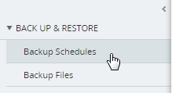
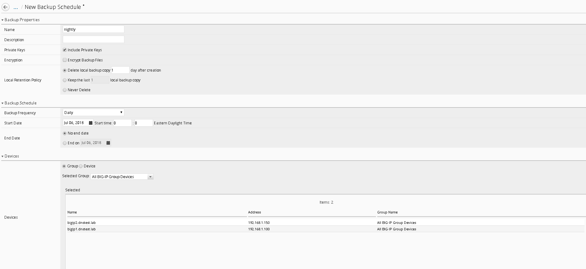
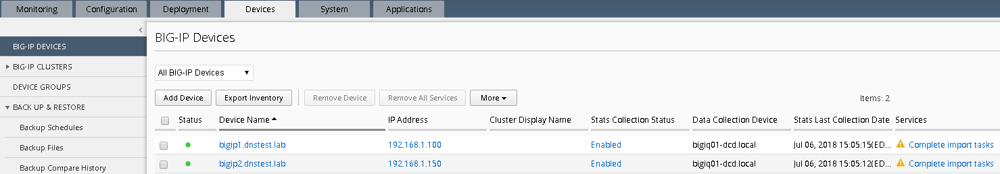
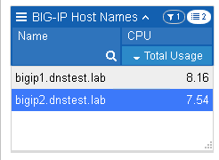
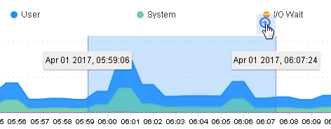

Lab Overview
============

Day 3, you get a little curious and wonder why both BIG-IP’s you’ve been
working on say they’re managed by BIG-IQ (look near the red f5 ball on
the top left of both BIG-IP’s). Unbelievable, all this time you’ve been
configuring both devices independently when you could have been
configuring them on a central management device.

Central Management Version - 6.0 was a major evolution of the BIG-IQ
product line designed to become the primary source of centralized
management for all physical and virtual F5 BIG-IP devices. BIG-IQ
extends its offerings for security users, improving the user experience,
and adding robustness and scale throughout the platform. 

Base BIG-IQ Configuration
-------------------------

In this lab, the VE has been configured with the basic system settings
and the VLAN/self-IP configurations required for the BIG-IQ to
communicate and pass traffic on the network. Additionally, the Data
Collection Device has already been added to BIG-IQ and the BIG-IP’s have
been imported and have been gathering health statistics. They have not
however had their configurations imported.

New features
------------

**STATISTICS DASHBOARDS –**

This is the real first step managing data statistics using a DCD (data
collection device) evolving toward a true analytics platform. In this
guide, we will explore setting up and establishing connectivity using
master key to each DCD (data collection device).

-  Enabling statistics for each functional area as part of the discovery
   process. This will allow BIG-IQ to proxy statistics gathered and
   organized from each BIG-IP device leveraging F5 Analytics iApp
   service (https://devcentral.f5.com/codeshare/f5-analytics-iapp).

-  Configuration and tuning of statistic collections post discovery
   allowing the user to focus on data specific to their needs.

-  Viewing and interaction with statistics dashboard, such as filtering
   views, differing time spans, selection and drilldown into dashboards
   for granular data trends and setting a refresh interval for
   collections.

**Auto-scaling in a VMware cloud environment**

You can now securely manage traffic to applications in a VMware cloud
environment, specifying the parameters in a service scaling group to
dynamically deploy and delete BIG-IP devices as needed. BIG-IQ manages
the BIG-IP devices that are load balancing to the BIG-IP VE devices in
the cloud, as well as to the BIG-IP devices' application servers.

**Auto-scaling in an AWS environment**

You can now securely manage traffic to applications in a VMware cloud
environment, specifying the parameters in a service scaling group to
dynamically deploy and delete BIG-IP devices as needed. You can manage
the BIG-IP VE devices from a BIG-IQ system on-premises, or in the cloud.
You have the option to use an F5 AWS Marketplace license, or your own
BIG-IP license.

**BIG-IQ VE deployment in MS Azure**

You can now deploy a BIG-IQ VE in a MS Azure cloud environment.

**Intuitive visibility for all managed applications**

BIG-IQ now provides an overview of all managed applications with the
option for a more detailed view of each application. Both the overview
and detailed views provide information about the application's
performance, Web Application Security status, and network statistics.

**Easy application troubleshooting based on application traffic and
security data**

You can now enable enhanced analytics to view detailed application data
in real-time, which allows you to isolate traffic characteristics that
are affecting your application's performance and security status.

**Real-time notifications for monitored devices and applications**

You can now receive real time alerts and events for BIG-IP devices and
their connected applications. These notifications are integrated into
the BIG-IQ UI charts and allow you to pinpoint activities that are
currently affecting your application.

**Enhanced HTTP and Web Application Security visibility for all
applications**

You can use the HTTP and Web Application Security Dashboards to monitor
all applications managed by BIG-IQ Centralized Management. These
dashboards allow you to compare applications, pool members, and other
aspects of traffic to your applications. In addition, the enhanced view
includes real time events and alerts within the charts, and enhanced
analytics data.

**Added object and management support for DNS features**

Creating, reading, updating, and deleting DNS GSLB objects, and
listeners is now supported from the BIG-IQ user interface and the API.

**Visibility into managed service scaling groups**

An automatically scalable environment of BIG-IP VE devices can be
defined to provide services to a set of applications. System
administrators of BIG-IQ Centralized Management can monitor performance
data for these BIG-IP VE devices.

**Enhanced DNS visibility & configuration**

BIG-IQ provides the ability to configure and have an enhanced view into
DNS traffic, which now includes both peak traffic values and average
traffic values over a selected period of time.

**Application templates**

Enhanced application/service templates that make deployments simple and
repeatable.

**Security policies and profiles available in applications**

You can now add security policies and profiles to applications,
including Web Application Security policies, Network Security firewall
policies, DoS profiles, and logging profiles.

**Automatically deploy policy learning**

You can now enable automatic deployment of policy learning using Web
Application Security.

**Extended ASM/advanced WAF management that includes**

-  Auto-deploy policy learning

-  Brute-force attack event monitoring

-  Event correlation

-  Manage DataSafe profiles

-  Initial ASM and HTTP monitoring dashboards

**Enhanced AFM Management**

-  AFM and DoS event visualization

-  Multi device packet tester

-  Enhanced debugging

**APM enhancements**

-  Management capabilities for APM Federation through BIG-IQ (SAML, IdP
   and SP)

-  Management capabilities for APM SSO configuration for Web Proxy
   Authentication Support Through BIG-IQ

**Manage cookie protection**

You can now manage cookie protection for BIG-IP devices using Web
Application Security.

**Monitoring dashboard for Web Application Security statistics**

You can review Web Application Security policy statistics using a
graphical dashboard.

**Manage DataSafe profiles**

You can now manage DataSafe profiles using Fraud Protection Security.

**Enhanced support for NAT firewalls**

You can now use the enhanced NAT firewall support in Network Security.

**Subscriber support in firewall rules**

You can now add subscriber IDs and groups to firewall rules in Network
Security for BIG-IP devices that support them.

**Firewall testing using packet flow reports**

You can now create and view packet flow reports to test firewall
configurations in Network Security.

**Support for multiple BIG-IP devices with packet tester reports**

You can now select multiple BIG-IP devices when generating packet tester
reports in Network Security.

**Renaming of firewall objects supported**

You can now rename firewall objects, such as firewall policies in
Network Security.

**Enhanced support for DoS profiles, device DoS configurations, and
scrubber profiles**

You can now manage additional features of DoS profiles, device DoS
configurations, and scrubber profiles that are found in BIG-IP version
13.1, such as new vectors, stress-based mitigation, DNS dynamic
signatures, and VLAN support in scrubber profiles.

**Copying device DoS configurations**

You can now copy device DoS configurations from one BIG-IP device to
multiple BIG-IP devices with the same version.

**Viewing logs for DoS and firewall events in the user interface**

You can now configure and view logging of DoS and firewall events, and
for DoS events, see that information in a graphical format.

Additional details can be found in the full release notes:

https://support.f5.com/kb/en-us/products/big-iq-centralized-mgmt/releasenotes/product/relnote-big-iq-central-mgmt-6-0-0.html

**BIG-IP Versions** AskF5 SOL with this info:

https://support.f5.com/kb/en-us/solutions/public/14000/500/sol14592.html

Changes to BIG-IQ User Interface
================================

The user interface in the 6.0 release navigation has changed to a more
UI tab-based framework.

In this section, we will go through the main features of the user
interface. Feel free to log into the BIG-IQ (https://192.168.1.50)
username: admin password: 401elliottW! device to explore some of these
features in the lab.

After you log into BIG-IQ, you will notice:

-  A navigation tab model at the top of the screen to display each high
   level functional area.

-  A tree based menu on the left-hand side of the screen to display
   low-level functional area for each tab.

-  A large object browsing and editing area on the right-hand side of
   the screen.

|image92|

-  Let us look a little deeper at the different options available in the
   bar at the top of the page.

|image93|

-  At the top, each tab describes a high-level functional area for
   BIG-IQ central management:

-  Monitoring –Visibility in dashboard format to monitor performance and
   isolate fault area.

-  Configuration – Provides configuration editors for each module area.

-  Deployment – Provides operational functions around deployment for
   each module area.

-  Devices – Lifecycle management around discovery, licensing and
   software install / upgrade.

-  System – Management and monitoring of BIG-IQ functionality.

-  Applications – Build, deploy, monitor service catalog-based
   applications centrally.

WORKFLOW 1: Creating a Backup Schedule

BIG-IQ is capable of centrally backing up and restoring all the BIG-IP
devices it manages. To create a simple backup schedule, follow the
following steps.

1. Click on the **Back Up & Restore** submenu in the Devices header.

2. |image94|\ Expand the **Back Up and Restore** menu item found on the
   left and click on **Backup Schedules**

3. Click the **Create** button

   |image95|

4. | Fill out the Backup Schedule using the following settings:
   | **Name:** Nightly
   | **Local Retention Policy:** Delete local backup copy 1 day after
     creation
   | **Backup Frequency:** Daily
   | **Start Time:** 00:00 Eastern Daylight Time
   | **Devices: Groups (radio button):** All BIG-IP Group Devices
   | Your screen should look similar to the one below.

|image96|\ **
**

5. Click **Save & Close** to save the scheduled backup job.

6. Optionally feel free to select the newly created schedule and select
   “Run Schedule Now” to immediately backup the devices.

   a. Add a Name for the Back Up

   b. Click **Start**

   c. When completed the backups will be listed under the Backup Files
      section

WORKFLOW 2: Uploading QKviews to iHealth for a support case
~~~~~~~~~~~~~~~~~~~~~~~~~~~~~~~~~~~~~~~~~~~~~~~~~~~~~~~~~~~

BIG-IQ can now push qkviews from managed devices to ihealth.f5.com and
provide a link to the report of heuristic hits based on the qkview.
These qkview uploads can be performed ad-hoc or as part of a F5 support
case. If a support case is specified in the upload job, the qkview(s)
will automatically be associated/linked to the support case. In addition
to the link to the report, the qkview data is accessible at
ihealth.f5.com to take advantage of other iHealth features like the
upgrade advisor.

1. Navigate to **Monitoring** **Reports** **Device** **iHealth
   Configuration**

..

   |image97|

2. | |image98|\ Add Credentials to be used for the qkview upload and
     report retrieval.
   | \*If you do not have credentials, please raise your hand and speak
     to an instructor\* Click the Add button under Credentials.

3. | Fill in the credentials that you used to access
     https://ihealth.f5.com:
   | Name: Give the credentials a name to be referenced in BIG-IQ
   | Username: <Username you use to access iHealth.f5.com>
   | Password: <Password you use to access iHealth.f5.com>
   | |image99|

4. Click the Test button to validate that your credentials work.

5. Click the Save & Close button in the lower right.

6. Click the QKview Upload Schedules button in the BIG-IP iHealth menu.

..

   **Monitoring** **Reports** **Device** **iHealth** **QKView Upload
   Schedule**

7. Click Create with the following values

   a. Name – Weekly Upload

   b. Description – Nightly QKView Upload

   c. Credential – (use what was created in step 3)

   d. Upload Frequecny – Weekly (Select Sunday)

   e. Start Time – Select todays date at 00:00

   f. End Date – No End date should be checked

   g. Select both devices

   h. Click the right arrow to move to the “Selected” Area

8. Click Save & Close\ |image100|

You will now have a fresh set of QKView in iHealth every Sunday morning.
This is extremely useful for when new cases are opened, one less step
you’ll need for support to engage quicker.

WORKFLOW 3: Device Import

BIG-IQ is capable of centrally managing multiple products, for this lab
we will only manage LTM and AFM. To import the device configurations,
follow the steps below

1. Navigate to the Devices tab and click on **BIG-IP Devices** (left
   panel)

|image101|

2. You’ll notice both devices have not completed the import tasks, to
   remedy this simply click on the “Complete Import Tasks” Link

3. First Re-discover the LTM service

4. Then Discover the AFM service

5. Once Re-discovery has completed, import both the LTM and AFM services

6. Repeat this same procedure for both devices, once completed your
   screen will show the following.

   a. For any conflicts you may encounter – leave BIG-IQ selected
      resolution

|image102|

BIG-IQ Statistics Dashboards 
=============================

WORKFLOW 1: Reviewing the data in the dashboards
~~~~~~~~~~~~~~~~~~~~~~~~~~~~~~~~~~~~~~~~~~~~~~~~

Navigate to **Monitoring Dashboards Device Health**

|image103|

WORKFLOW 2: Interacting with the data in the dashboards
~~~~~~~~~~~~~~~~~~~~~~~~~~~~~~~~~~~~~~~~~~~~~~~~~~~~~~~

-  | You can narrow the scope of what is graphed by selecting a object
     or objects from the selection panels on the right. For example, if
     you only want to see data from BIG-IP01, you can click on it to
     filter the data.
   | |image104|

-  You can create complex filters by making additional selections in
   other panels

-  | You can zoom in on a time, by selecting a section of a graph or
     moving the slider at the top of the page
   | |image105|
   | or
   | |image106|

-  All the graphs update to the selected time.

-  | You can change how far in the data you want to look back by using
     the selection in the upper left (note you may need to let some time
     elapse before this option becomes available)
   | |image107|

.. |image90| image:: ../media/image1.jpeg
   :width: 3.27778in
   :height: 1.14444in

.. |image93| image:: ../media/image90.png
   :width: 6.49097in
   :height: 2.67569in

.. |image95| image:: ../media/image92.png
   :width: 2in
   :height: 1.47917in

.. |image97| image:: ../media/image94.png
   :width: 6.5in
   :height: 2.7in
.. |image98| image:: ../media/image95.png
   :width: 1.88472in
   :height: 0.92639in
.. |image99| image:: ../media/image96.png
   :width: 3.37624in
   :height: 2.14141in
.. |image100| image:: ../media/image97.png
   :width: 5.13861in
   :height: 2.70482in

.. |image103| image:: ../media/image100.png
   :width: 6.5in
   :height: 2.34236in

.. |image106| image:: ../media/image103.png
   :width: 4.48902in
   :height: 0.91655in

