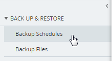
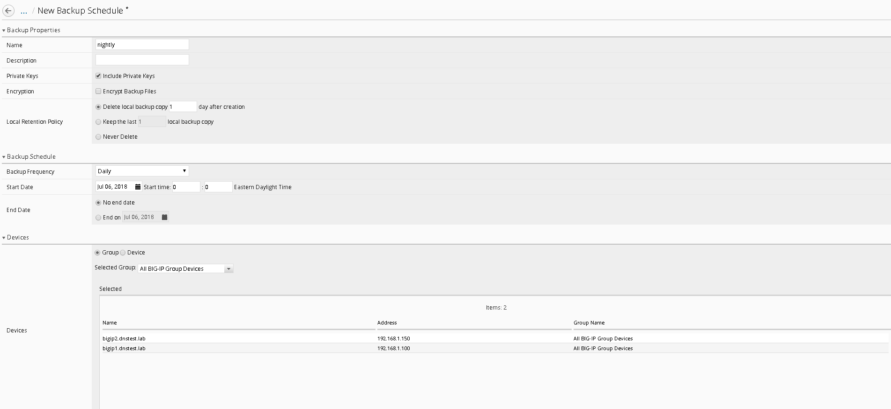

WORKFLOW 1: Creating a Backup Schedule
--------------------------------------

BIG-IQ is capable of centrally backing up and restoring all the BIG-IP
devices it manages. To create a simple backup schedule, follow the
following steps.

1. Click on the **Back Up & Restore** submenu in the Devices header.

2. |image94|\ Expand the **Back Up and Restore** menu item found on the
   left and click on **Backup Schedules**

3. Click the **Create** button

   |image95|

4. | Fill out the Backup Schedule using the following settings:
   | **Name:** Nightly
   | **Local Retention Policy:** Delete local backup copy 1 day after
     creation
   | **Backup Frequency:** Daily
   | **Start Time:** 00:00 Eastern Daylight Time
   | **Devices: Groups (radio button):** All BIG-IP Group Devices
   | Your screen should look similar to the one below.

|image96|

5. Click **Save & Close** to save the scheduled backup job.

6. Optionally feel free to select the newly created schedule and select
   “Run Schedule Now” to immediately backup the devices.

   a. Add a Name for the Back Up

   b. Click **Start**

   c. When completed the backups will be listed under the Backup Files
      section

.. |image95| image:: ../media/image92.png
   :width: 2in
   :height: 1.47917in

